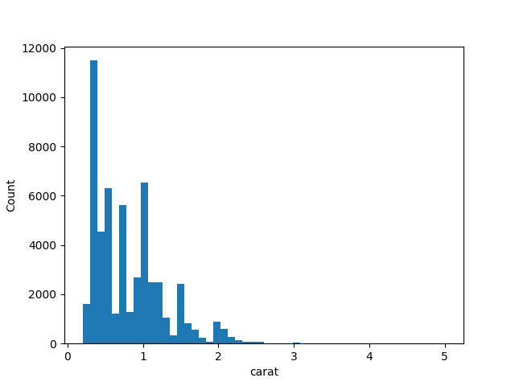
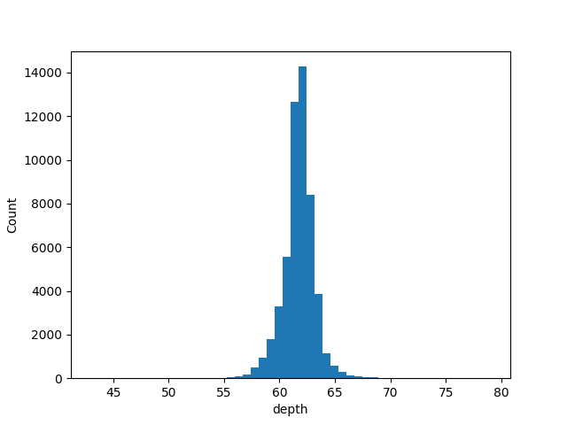
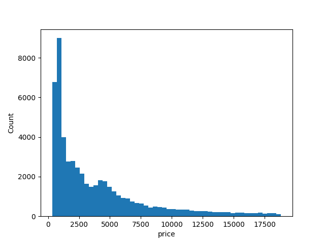
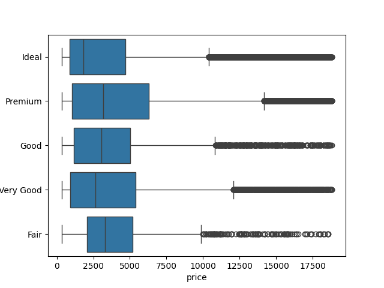
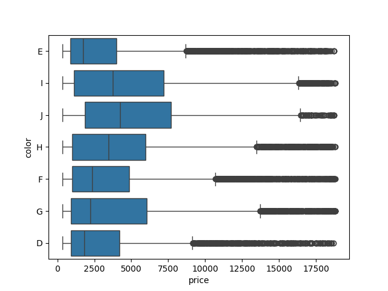
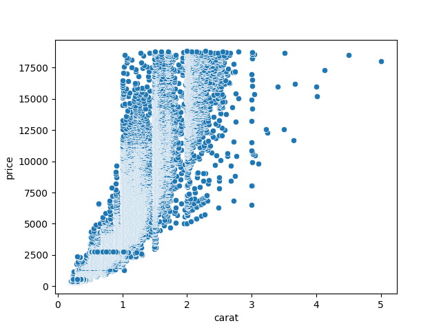
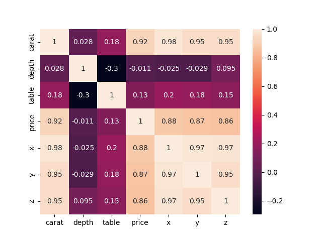

<pre>
   Unnamed: 0  carat      cut color clarity  ...  table  price     x     y     z
0           1   0.23    Ideal     E     SI2  ...   55.0    326  3.95  3.98  2.43
1           2   0.21  Premium     E     SI1  ...   61.0    326  3.89  3.84  2.31
2           3   0.23     Good     E     VS1  ...   65.0    327  4.05  4.07  2.31
3           4   0.29  Premium     I     VS2  ...   58.0    334  4.20  4.23  2.63
4           5   0.31     Good     J     SI2  ...   58.0    335  4.34  4.35  2.75

[5 rows x 11 columns]
Duplicates: Empty DataFrame
Columns: [Unnamed: 0, carat, cut, color, clarity, depth, table, price, x, y, z]
Index: []
Missing values: Empty DataFrame
Columns: [Unnamed: 0, carat, cut, color, clarity, depth, table, price, x, y, z]
Index: []
Columns: Index(['Unnamed: 0', 'carat', 'cut', 'color', 'clarity', 'depth', 'table',
       'price', 'x', 'y', 'z'],
      dtype='object')
Columns: Index(['carat', 'cut', 'color', 'clarity', 'depth', 'table', 'price', 'x', 'y',
       'z'],
      dtype='object')
   carat      cut color clarity  depth  table  price     x     y     z
0   0.23    Ideal     E     SI2   61.5   55.0    326  3.95  3.98  2.43
1   0.21  Premium     E     SI1   59.8   61.0    326  3.89  3.84  2.31
2   0.23     Good     E     VS1   56.9   65.0    327  4.05  4.07  2.31
3   0.29  Premium     I     VS2   62.4   58.0    334  4.20  4.23  2.63
4   0.31     Good     J     SI2   63.3   58.0    335  4.34  4.35  2.75
carat      float64
cut         object
color       object
clarity     object
depth      float64
table      float64
price        int64
x          float64
y          float64
z          float64
dtype: object
Column 'cut' has values: ['Ideal' 'Premium' 'Good' 'Very Good' 'Fair']
Column 'color' has values: ['E' 'I' 'J' 'H' 'F' 'G' 'D']
Column 'clarity' has values: ['SI2' 'SI1' 'VS1' 'VS2' 'VVS2' 'VVS1' 'I1' 'IF']
Numeric columns: ['carat', 'depth', 'table', 'price', 'x', 'y', 'z']
Среднее значение:
carat       0.797940
depth      61.749405
table      57.457184
price    3932.799722
x           5.731157
y           5.734526
z           3.538734
dtype: float64
Медиана:
carat       0.70
depth      61.80
table      57.00
price    2401.00
x           5.70
y           5.71
z           3.53
dtype: float64
Мода:
   carat  depth  table  price     x     y    z
0    0.3   62.0   56.0    605  4.37  4.34  2.7
</pre>

Среднее значение говорит о том, где находится центр распределения данных.
Медиана делит распределение на две равные части, и она менее чувствительна к выбросам, чем среднее значение.
Мода представляет наиболее часто встречающееся значение в данных.
Данные находятся в разных диапазонах - возможно их нужно будет нормализовать
Длина и ширина алмазов в среднем равны
По сравнению со средней ценой 3932 в выборке самая популярная цена алмаза 605

