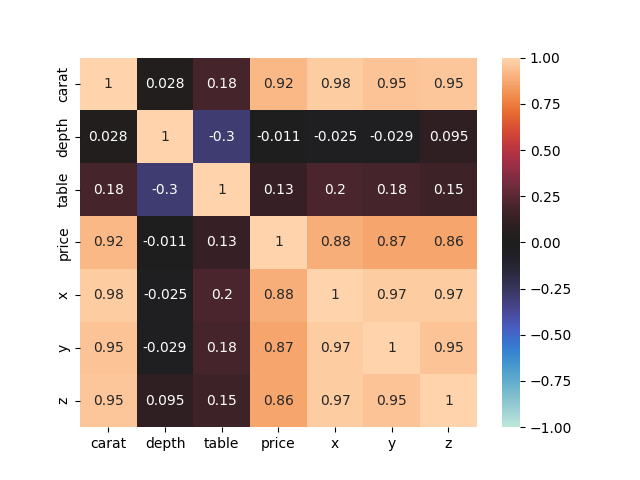

# Разведочный анализ данных для датасета `diamonds.csv`

## Описание датасета:
Датасет `diamonds.csv` содержит следующие столбцы:
- `carat`: вес алмаза в каратах.
- `cut`: качество огранки алмаза (Fair, Good, Very Good, Premium, Ideal).
- `color`: цвет алмаза, от J (худший) до D (лучший).
- `clarity`: чистота алмаза (от I1 до IF).
- `depth`: общая глубина в процентах от вершины до основания.
- `table`: ширина верхней части алмаза относительно самой широкой точки.
- `price`: цена алмаза в долларах США.
- `x`: длина алмаза в мм.
- `y`: ширина алмаза в мм.
- `z`: глубина алмаза в мм.

## Гистограммы
### Гистограмма карата

### Гистограмма глубины

### Гистограмма цены

## Box-plots
### Box-plot цены от качества огранки

### Box-plot цены от цвета

### Scatter plot цены от карат

### Тепловая карта всех численных переменных

